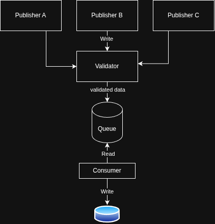

# Pub/Sub Event Pipeline (Go + PostgreSQL)

Small event-processing project that simulates multiple publishers, validates events, and persists only valid events to PostgreSQL.

## What this project does

- Publishes user events and commerce events concurrently.
- Publishes additional invalid (gibberish) user events to test validation.
- Validates incoming events before storage.
- Consumes valid events and stores them in PostgreSQL.

## Architecture Diagram


## High-level flow

1. `main.go` starts PostgreSQL connection.
2. Publishers send events into channels:
	 - user stream (`publisher.StartPublishingUsers`)
	 - gibberish stream (`publisher.StartPublishingGibberish`)
	 - commerce stream (`publisher.StartPublishingCommerce`)
3. Validator filters each stream:
	 - invalid events are logged with `❌ INVALID ...`
	 - valid events are forwarded to consumer channels
4. Generic consumer (`StartConsuming[T]`) persists valid events.
5. Successful persistence is logged with `✅ Received ...`

## Project structure

```text
.
├── main.go
├── consumer/
│   └── consumer.go
├── db/
│   ├── db.go
│   └── seed.sql
├── publisher/
│   ├── users.go
│   ├── giberish.go
│   └── eCommerce.go
└── validator/
		└── validator.go
```

## Event contracts

### UserEvent

```json
{
	"event": "user.signed_up | feature.clicked",
	"user_id": "user_001",
	"timestamp": "RFC3339 timestamp",
	"properties": {
		"total": 123.45,
		"page": "/home"
	}
}
```

### CommerceEvent

```json
{
	"event": "page.viewed | page.scrolled | order.placed | payment.failed",
	"user_id": "user_001",
	"path": "/home"
}
```

## Validation rules

### UserEvent (`validator.ValidateUserEvent`)

- `event` must be one of: `user.signed_up`, `feature.clicked`
- `user_id` cannot be empty
- `timestamp` cannot be zero
- `properties.total` must be non-negative

### CommerceEvent (`validator.ValidateCommerceEvent`)

- `event` must be one of: `page.viewed`, `page.scrolled`, `order.placed`, `payment.failed`
- `user_id` cannot be empty
- `path` cannot be empty

## Requirements

- Go `1.26.1` (as declared in `go.mod`)
- Docker + Docker Compose
- PostgreSQL client (optional, for manual SQL setup)

## Environment variables

Create a `.env` file in project root:

```env
POSTGRES_USER=postgres
POSTGRES_PASSWORD=postgres
POSTGRES_DB=pubsub
POSTGRES_HOST=localhost
POSTGRES_PORT=5432
```

## Database setup

Start PostgreSQL with Docker:

```bash
docker compose up -d
```

Then create tables (recommended SQL):

```sql
CREATE EXTENSION IF NOT EXISTS "pgcrypto";

DO $$
BEGIN
	IF NOT EXISTS (SELECT 1 FROM pg_type WHERE typname = 'event_type') THEN
		CREATE TYPE event_type AS ENUM ('USER_EVENT', 'COMMERCE_EVENT');
	END IF;
END $$;

CREATE TABLE IF NOT EXISTS events (
	id UUID PRIMARY KEY DEFAULT gen_random_uuid(),
	event VARCHAR(255) NOT NULL,
	user_id VARCHAR(255) NOT NULL,
	timestamp TIMESTAMPTZ,
	path VARCHAR(255),
	type event_type NOT NULL,
	created_at TIMESTAMPTZ DEFAULT now()
);

CREATE TABLE IF NOT EXISTS properties (
	event_id UUID PRIMARY KEY REFERENCES events(id) ON DELETE CASCADE,
	total FLOAT NOT NULL,
	page TEXT NOT NULL
);
```

> Note: current `db/seed.sql` appears incomplete (enum declaration syntax and a missing comma). Use the SQL above or update `db/seed.sql` accordingly.

## Run

```bash
go mod tidy
go run .
```

You should see a mix of logs:

- `SENDING: ...` from publishers
- `❌ INVALID ...` for rejected events
- `✅ Received ...` for persisted valid events

Stop with `Ctrl+C`.

## Current behavior notes

- User and gibberish publishers share one user-event channel; it closes after both finish.
- Commerce publisher currently does not close its channel, and `main` blocks forever with `select {}`.
- This is fine for a continuously running local demo, but graceful shutdown can be added later.
